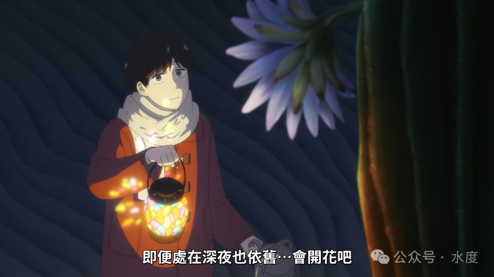
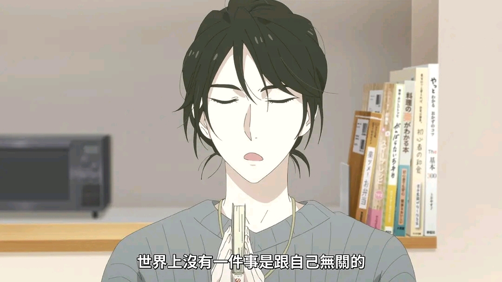

---
hide:
  - navigation
  - toc
title: 主页
---

<!-- ==================== Hero 区 ==================== -->

  

    
AQUACODR'S BLOG

    <h1 class="hero-title">学以聚之，思以辨之 偶得而栖之</h1>
    
一个我用来记录学习、生活与阅读感悟的地方，欢迎驻足。

  

<!-- ==================== 光影收藏 ==================== -->
<h2 class="gallery-title">makio、asa、erii</h2>

  

    
  

  

    
  

  

    
  

  

    
  

<!-- ==================== 东京爱情故事 ==================== -->

  
  

    如果你在东京街头， 
    遇到一个眼睛微笑得像月牙一样的女孩， 
    那是我爱过的女孩， 
    她的名字叫做赤名莉香。
  

