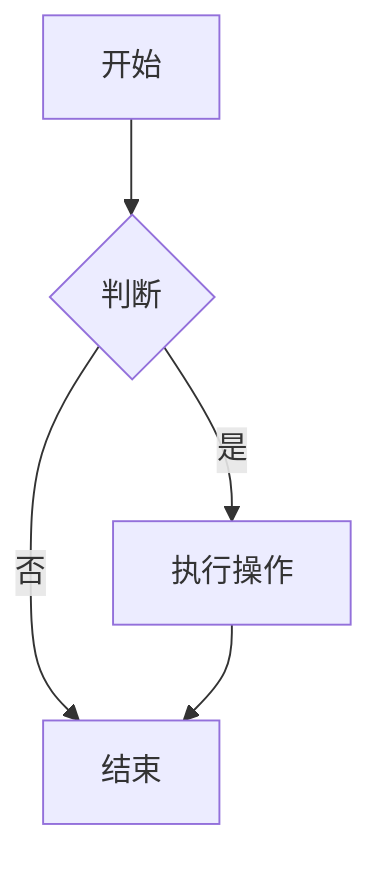

# 我的网站使用手册

## 一、网站更新规定

### 1.每次更新内容后

```bash
# 1. 本地预览（确保内容正确）
python -m mkdocs serve
# 访问 http://127.0.0.1:8000 确认

# 2. 推送到远程（一键完成）
python -m mkdocs gh-deploy --force

# 3. 等待 1-2 分钟
# 4. 访问 https://aquacodr.github.io 查看更新
```

### 2.更新源代码到 main 分支（可选）

```bash
# 如果需要同步源代码到 main 分支
git add .
git commit -m "更新文档内容"
git push origin main
```

## **二、功能详解及使用说明**

### **1. 彩色提示框（admonition）🎨**

**作用**：创建彩色区块，用于强调内容

```markdown
!!! note "这是一个笔记"
    普通笔记内容。

!!! tip "小贴士"
    这里是一些有用的提示。

!!! warning "警告"
    重要的事情说三遍！

!!! success "成功"
    操作成功了！

!!! failure "失败"
    这里有问题需要注意。
```

效果如下：

!!! note "这是一个笔记"
    普通笔记内容。

!!! tip "小贴士"
    这里是一些有用的提示。

!!! warning "警告"
    重要的事情说三遍！

!!! success "成功"
    操作成功了！

!!! failure "失败"
    这里有问题需要注意。

### **2. 自动目录（toc）📑**

**作用**：自动在页面右侧生成导航目录

效果见右侧

**配置说明**：

- `permalink: true` - 标题旁显示🔗图标，可复制链接
- `toc_depth: 3` - 只显示3级标题（1-3级）

### **3. 代码高亮（pymdownx.highlight）💻**

**作用**：漂亮的代码显示，带行号和语法高亮

~~~markdown
```python linenums="1"
def hello_world():
    """打印Hello World"""
    print("Hello World!")
    return True
```

```javascript
// JavaScript代码
function sayHello() {
    console.log("Hello!");
}
```
~~~

效果 如下：

```python linenums="1"
def hello_world():
    """打印Hello World"""
    print("Hello World!")
    return True
```

```javascript
// JavaScript代码
function sayHello() {
    console.log("Hello!");
}
```

**行号用法**：

- `linenums="1"` - 从第1行开始编号
- `linenums="10"` - 从第10行开始编号
- 不写`linenums` - 自动编号

### **4. 增强代码块（pymdownx.superfences）📦**

**作用**：支持特殊格式的代码块

**① Mermaid流程图**：

~~~markdown

~~~

效果如下：


**② 代码块标题**：

~~~markdown
```python title="hello.py"
print("Hello")
```
~~~

效果如下：

```python title="hello.py"
print("Hello")
```

### **5. 折叠内容（pymdownx.details）📂**

**作用**：创建可展开/收起的内容块

```markdown
??? note "点击查看答案"
    这里是隐藏的答案内容。

???+ note "默认展开的内容"
    这个默认就是展开的。
    ??? warning "嵌套的折叠"
        还可以嵌套哦！
```

效果如下：

??? note "点击查看答案"
    这里是隐藏的答案内容。

???+ note "默认展开的内容"
    这个默认就是展开的。
    ??? warning "嵌套的折叠"
        还可以嵌套哦！

**符号说明**：

- `???` - 默认收起
- `???+` - 默认展开

### **6. Emoji表情（pymdownx.emoji）😊**

**作用**：插入各种表情符号

```markdown
常用表情：
:smile: :heart: :rocket: :thumbsup: :star:

天气：
:sunny: :cloud: :rain: :snowflake:

箭头：
:arrow_right: :arrow_left: :arrow_up: :arrow_down:
```

效果如下：

常用表情：
:smile: :heart: :rocket: :thumbsup: :star:

天气：
:sunny: :cloud: :rain: :snowflake:

箭头：
:arrow_right: :arrow_left: :arrow_up: :arrow_down:

**查找更多**：访问 [emoji-cheat-sheet.com](https://www.webfx.com/tools/emoji-cheat-sheet/)

### **7. 任务清单（pymdownx.tasklist）✅**

**作用**：创建待办事项列表

```markdown
#### 今日任务
- [x] 完成博客配置
- [x] 学习Markdown扩展
- [ ] 写一篇新文章
- [ ] 回复评论

#### 购物清单
- [ ] 牛奶
- [ ] 面包
- [x] 鸡蛋
```

效果如下：

#### 今日任务

- [x] 完成博客配置
- [x] 学习Markdown扩展
- [ ] 写一篇新文章
- [ ] 回复评论

#### 购物清单
- [ ] 牛奶
- [ ] 面包
- [x] 鸡蛋

### **8. 脚注（footnotes）👣**

**作用**：在页面底部添加注释

```markdown
这是一个带有脚注的句子[^1]。

[^1]: 这是脚注的内容，会显示在页面底部。

另一个脚注[^note]。

[^note]: 脚注可以有自定义名称。
```

效果如下：

这是一个带有脚注的句子[^1]。

[^1]: 这是脚注的内容，会显示在页面底部。

另一个脚注[^note]。

[^note]: 脚注可以有自定义名称。


# 测试公式渲染
## 行内公式（[] 格式）
样本方差公式：[ S^2 = \frac{1}{n-1} \sum_{i=1}^{n} (X_i - \overline{X})^2 ]

## 块级公式（[[]] 格式）
[[
\int_{-\infty}^{+\infty} f(x) dx = 1
]]

## 兼容原有 $/$$ 格式（仍可用）
行内：$E=mc^2$
块级：
$$
\sum_{k=1}^n k = \frac{n(n+1)}{2}
$$