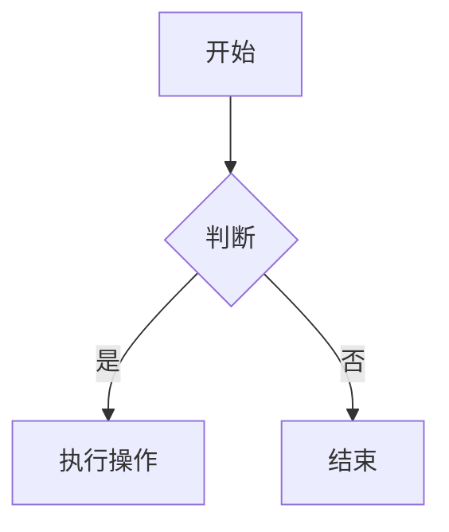

# 🛠️ 网站使用手册

本站基于 **MkDocs + Material 主题** 构建，部署在 GitHub Pages。
以下是日常更新与常用语法的完整说明。

---

## 🚀 一、更新流程

### 1. 每次更新内容后

```bash
# 1. 本地预览（确保内容正确）
python -m mkdocs serve
# 访问 http://127.0.0.1:8000 确认效果

# 2. 一键构建并部署到 GitHub Pages
python -m mkdocs gh-deploy --force

# 3. 等待 1-2 分钟
# 4. 访问 https://aquacodr.github.io 查看更新
```

### 2. 同步源代码到 main 分支

```bash
git add .
git commit -m "更新文档内容"
git push origin main
```

> 💡 **推荐顺序**：先 `git push origin main` 保存源码，再执行 `mkdocs gh-deploy` 部署站点，这样 `gh-pages` 分支总能基于最新的 `main`。

---

## 🗂️ 二、目录结构

```
aquacodr-blog/
├── mkdocs.yml          # 网站配置（主题、插件、扩展）
├── docs/               # 文章源文件（Markdown / Obsidian 仓库）
│   ├── index.md        # 首页
│   ├── tags.md         # 标签索引页（自动生成）
│   ├── ZJU学习/        # 课程笔记
│   ├── 自学/           # 自学路线与课程
│   ├── 技术/           # 技术折腾
│   ├── 阅读/           # 读书与讲座
│   ├── 记忆碎片/       # 随笔回忆
│   └── 网站上传信息步骤.md   # 本手册
├── 草稿箱/             # 未发布的草稿（不上传到网站）
└── site/               # 构建产物（自动生成，勿手动修改）
```

> ⚠️ **注意**：`site/` 目录由构建自动生成，**不要手动编辑**；`草稿箱/` 内的内容不会出现在网站上。

---

## ✍️ 三、常用语法速查

### 1. 彩色提示框（Admonition）🎨

```markdown
!!! note "这是一个笔记"
    普通笔记内容。

!!! tip "小贴士"
    一些有用的提示。

!!! warning "警告"
    重要的事情说三遍！

!!! success "成功"
    操作成功了！

!!! failure "失败"
    这里有问题需要注意。
```

效果如下：

!!! note "这是一个笔记"
    普通笔记内容。

!!! tip "小贴士"
    一些有用的提示。

!!! warning "警告"
    重要的事情说三遍！

!!! success "成功"
    操作成功了！

!!! failure "失败"
    这里有问题需要注意。

### 2. 折叠内容（Details）📂

```markdown
??? note "点击展开"
    这里是隐藏内容。

???+ note "默认展开"
    这个默认就是展开的。
```

- `???` — 默认收起
- `???+` — 默认展开

### 3. 代码高亮 💻

```markdown
```python linenums="1"
def hello():
    print("Hello World!")
```
```

特性：行号、语法高亮、右上角一键复制、可加 `title="文件名"`。

### 4. Mermaid 流程图 📊

~~~markdown

```mermaid
graph TD
    A[开始] --> B{判断}
    B -->|是| C[执行操作]
    B -->|否| D[结束]
```
~~~

### 5. 数学公式（MathJax）🧮

- 行内公式：`$E=mc^2$`
- 块级公式：

```markdown
$$\int_{0}^{\infty} e^{-x^2} dx = \frac{\sqrt{\pi}}{2}$$
```

### 6. 任务清单 ✅

```markdown
- [x] 已完成
- [ ] 待完成
```

### 7. Emoji 表情 😊

` :smile: :heart: :rocket: :thumbsup: :star:`（更多见 [emoji-cheat-sheet](https://www.webfx.com/tools/emoji-cheat-sheet/)）

### 8. 脚注 👣

```markdown
这是一个带脚注的句子[^1]。

[^1]: 脚注内容会显示在页面底部。
```

### 9. 自定义图片大小 🖼️

```markdown
{ width="400" }
```

---

## 🏷️ 四、给文章打标签

在文章开头添加 YAML 元数据即可，标签会自动聚合到 [标签索引](tags.md)：

```markdown
---
tags:
  - 课程笔记
  - 微机原理
---
```

---

## ❓ 五、常见问题

**Q：新增一篇文章需要改哪些地方？**
在对应栏目下新建 `.md` 文件即可，导航会自动收录（`awesome-pages` 插件会自动排序，无需手动改导航）。

**Q：文章写好但暂时不想发布？**
放入仓库根目录的 `草稿箱/` 文件夹，它不会被构建到网站上。

**Q：如何修改网站主题 / 配色？**
编辑 `mkdocs.yml` 中的 `theme.palette`；自定义样式写在 `docs/stylesheets/custom.css`。

**Q：Obsidian 中的双链 `[[笔记]]` 能显示吗？**
可以，本站已启用 `roamlinks` 插件，支持双链解析。

**Q：为什么首页的"最近更新"没有自动更新？**
首页"最近更新"是手动维护的列表，发布新文章后记得顺手更新 `docs/index.md` 中的列表。
